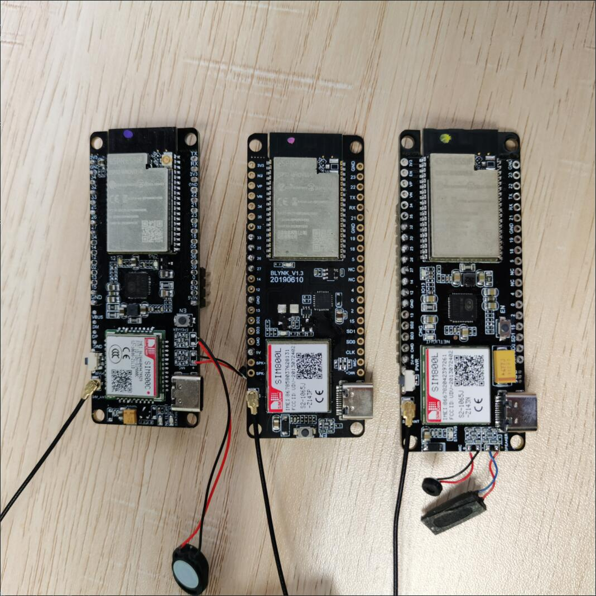

<h1 align = "center">🌟LilyGo T-Call SIM800 Series🌟</h1>



<h2 align = "left">Product 📷:</h2>

|                      Examples                      |                           Product  Link                            |                          Schematic                          | Status | Recommended level |
| :------------------------------------------------: | :----------------------------------------------------------------: | :---------------------------------------------------------: | :----: | :---------------: |
| [SIM800L IP5306 20190610](./doc/SIM800L_IP5306.MD) |  [Product link](https://www.aliexpress.com/item/33045221960.html)  | [Schematic](./schematic/LilyGo-SIM800L-IP5306-20190610.pdf) |   ✅    |         ⭐         |
| [SIM800L IP5306 20200811](./doc/SIM800L_IP5306.MD) | [Product link](https://pt.aliexpress.com/item/4000959701330.html)  | [Schematic](./schematic/LilyGo-SIM800L-IP5306-20200811.pdf) |   ✅    |        ⭐⭐         |
| [SIM800L AXP192 20200327](./doc/SIM800L_AXP192.MD) | [Product link](https://www.aliexpress.com/item/4000959701330.html) |  [Schematic](./schematic/LilyGo-SIM800L-PMU-20200409.pdf)   |   ✅    |        ⭐⭐⭐        |
| [SIM800C AXP192 20200609](./doc/SIM800C_AXP192.MD) | [Product link](https://pt.aliexpress.com/item/4001274909689.html)  |    [Schematic](./schematic/LilyGo-SIM800C-20200630.pdf)     |   ✅    |        ⭐⭐⭐        |

## Datasheet
- [SIM800 AT Command](./datasheet/sim800_series_at_command_manual_v1.01.pdf)
- [SIM800 Hardware Design](./datasheet/SIM800_Hardware%20Design_V1.08.pdf)
- [AXP192](http://www.x-powers.com/en.php/Info/product_detail/article_id/29)
- [IP5306](./datasheet/IP5306%20REG%20V1.4.pdf)


## FAQ

### 1. **If you are unable to download, please try the following steps, if it still does not work, please contact customer service**
1. Open the serial monitor
2. Short IO0 to GND
3. Press the RESET button on the board, if the serial port communication is normal, then you should see
    ```
    ets Jun 8 2016 00:22:57

    rst:0x1 (POWERON_RESET),boot:0x3 (DOWNLOAD_BOOT(UART0/UART1/SDIO_REI_REO_V2))
    waiting for download
    ```
4. If you can see the above message, it means that the communication is normal, then all you need is to let it enter the waiting download mode, then you can click upload, usually it can solve the problem of not being able to download automatically

### 2. **About the 5V power pin description on the board:**

1. For IP5306 power supply, the 5V power pin on the board is the output, which is boosted by the IP5306 power chip. When using USB and battery, it can provide 5V output. According to the manual, it can provide a maximum output current of 2.4A .

2. When using AXP192 power supply, the 5V power pin on the board is the input, and it is connected with USB 5V+. There is no other power output on the board except for the 3.3V output.