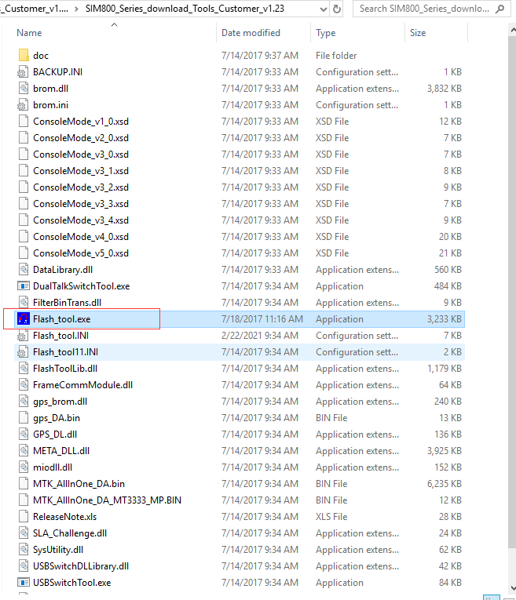
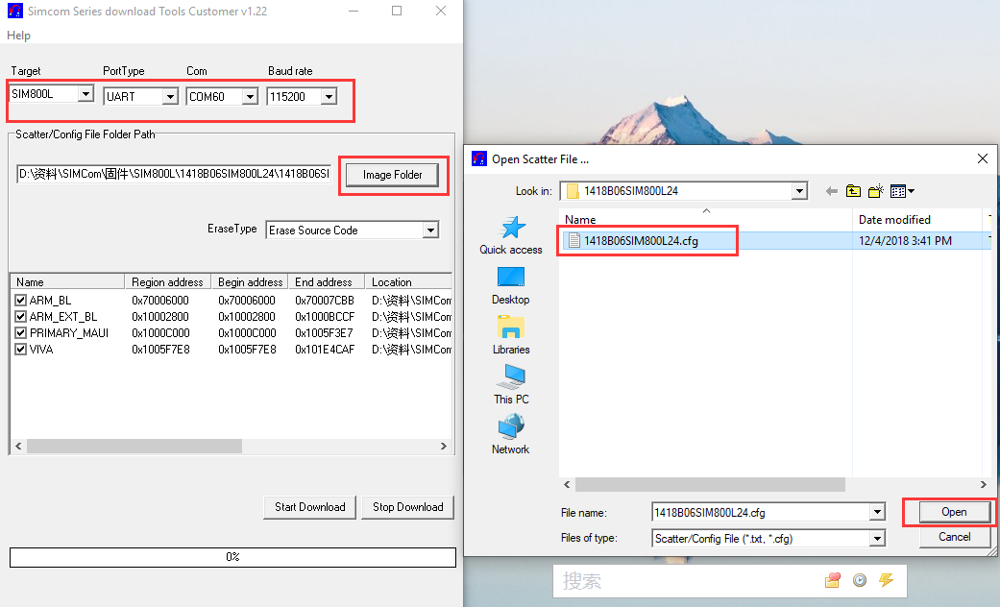
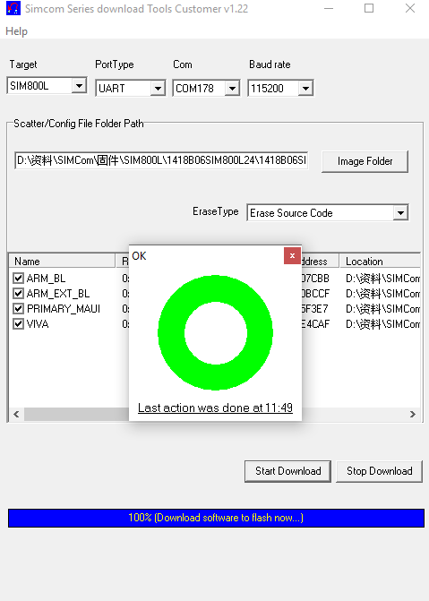

# Step

```bash
SIM800 built-in firmware update tool Because SIMCOM has not adapted and updated the new system for a long time, it is not necessarily available to upgrade the built-in firmware tool. Most users are stuck waiting for download. Please be informed

```

## 1. First, you need to update the ESP32's built-in firmware, open the `UpdateFirmware` example, compile and burn it into the board. 

## 2. Unzip `SIM800_Series_download_Tools_Customer_v1.23.rar` 

## 3. Open `Flash_tool.exe`



### 4. Select the relative firmware and port according to the diagram 



### 5. Wait for the board indicator to light up, then click the `Start Download` button, and wait for it to finish 



# Firmware Link

- [Flash Tools](https://drive.google.com/file/d/10vdCpkkIqNJgv__gS-UiqMGG8SjLcOAY/view?usp=sharing)
- [SIM800L 1309B10SIM800L16](https://drive.google.com/file/d/113vc3ZM0Q1w6rW1ycc6x3apyU7B4XSm6/view?usp=sharing)
- [SIM800C 1309B12SIM800H32](https://drive.google.com/file/d/116Ddasj-t7ceH3Ql5xfgSKEsQudqG6xC/view?usp=sharing)
