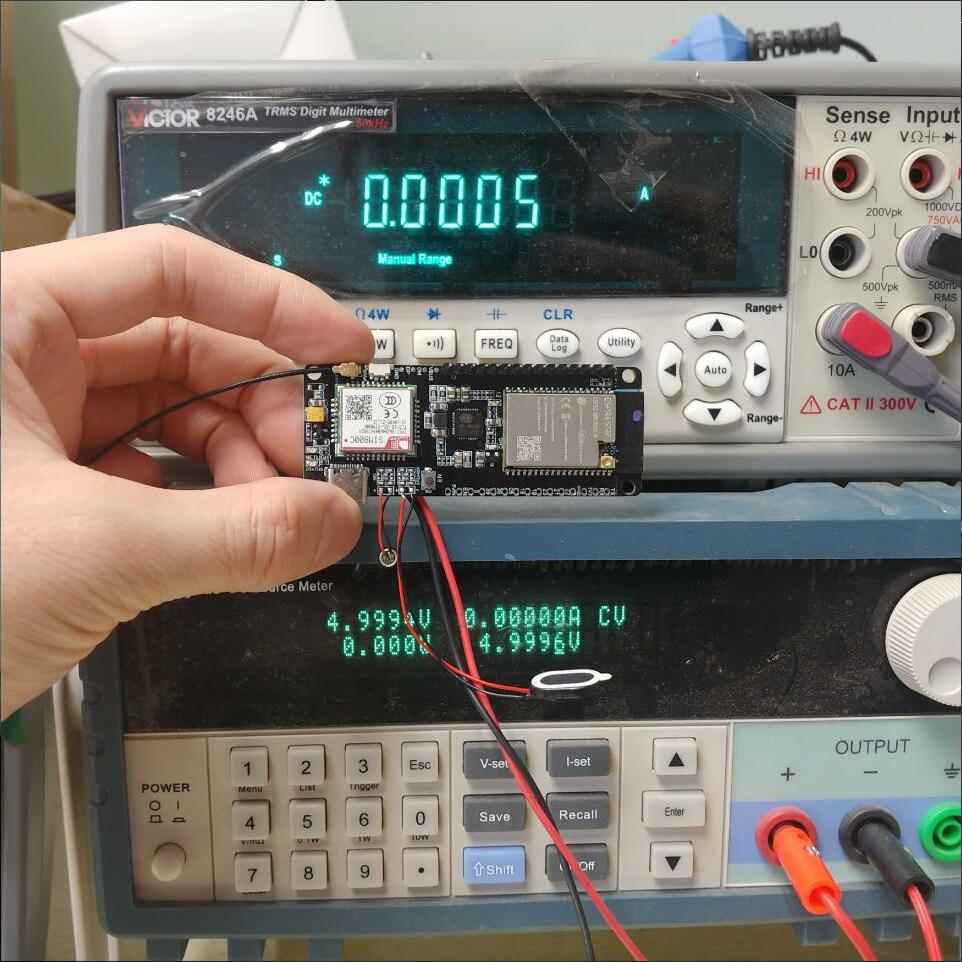
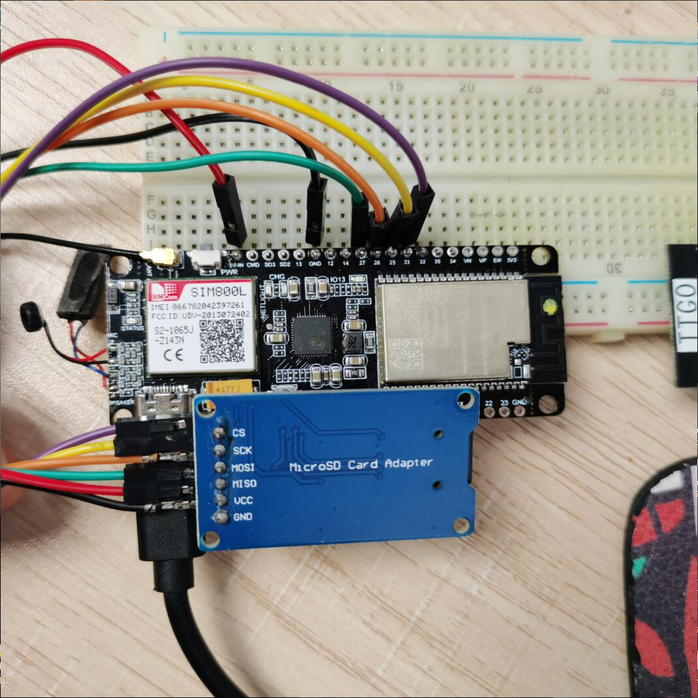

# Product

Update later

# Note
- For the first time, please remember to define the board model you use at the beginning of the sketch

# Introduction
AXP192 is the power supply used on the SIM800L board. It is an upgraded version of the IP5306 version. The following points are upgraded:
1. Change the power IC to AXP192 PMU management, support coulomb counter and high-precision voltage and current detection function, please refer to [X-Power official website](http://www.x-powers.com/en.php/Info/product_detail/article_id/29)
2. SIM800L **RI** Pin leads to ESP32, can wake up from receiving voice or data calls, and receiving messages
3. SIM800L **DTR** Pin leads to ESP32, which can wake up SIM800L from sleep state
4. The old and new versions are fully compatible and can be used as general examples. You don't need to care about the control of the AXP192 power chip, you can replace the new board on your original code without programming the AXP192, and provide AXP192 control example code

## Examples for SIM800L & SIM800C
- Arduino + TinyGSM library: [/examples/Arduino_TinyGSM](/examples/Arduino_TinyGSM)

##  Pin definition
|     Name     | SIM800C |
| :----------: | :-----: |
|  MODEM  TX   |   26    |
|  MODEM  RX   |   27    |
| MODEM PWRKEY |    4    |
|  MODEM RST   |   NC    |
| MODEM POWER  |   25    |
|  MODEM DTR   |   32    |
|   MODEM RI   |   33    |
|   PMU SDA    |   21    |
|   PMU SCL    |   22    |
|   PMU IRQ    |   35    |
|   User LED   |   12    |

# Sleep current

# SD card connection
