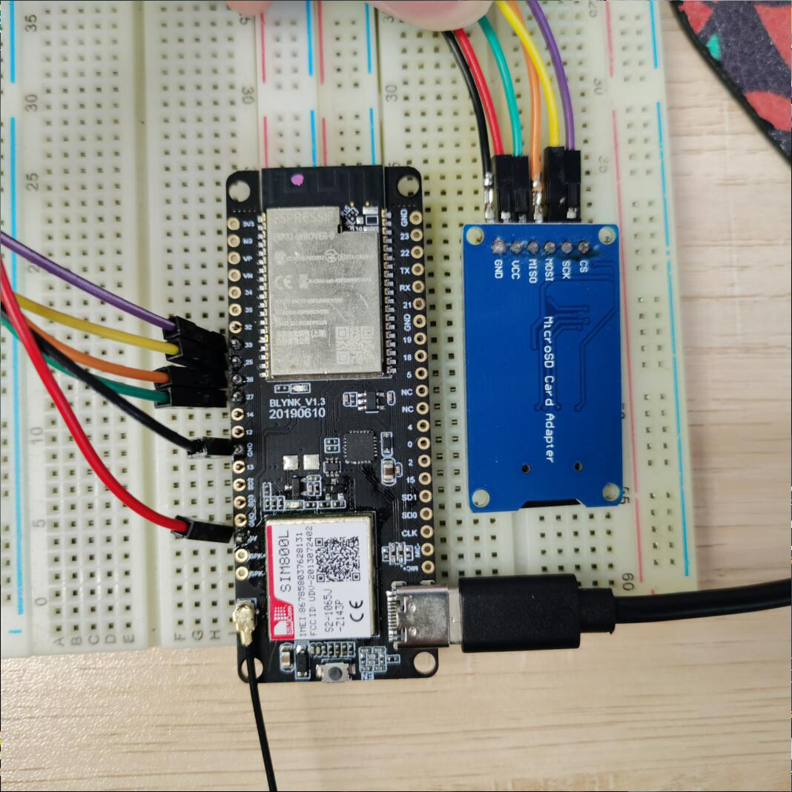

# Product

## Examples for SIM800L IP5306 Version

- Loboris Micropython: [/examples/MicroPython_LoBo](/examples/MicroPython_LoBo)
- Arduino + TinyGSM library: [/examples/Arduino_TinyGSM](/examples/Arduino_TinyGSM)
- Arduino OTA update over GSM: [/examples/Arduino_GSM_OTA](/examples/Arduino_GSM_OTA)
- ESP-IDF: https://github.com/espressif/esp-idf/tree/master/examples/protocols/pppos_client
- Platformio Arduino_Thingsboard :[/examples/Platformio_Arduino_Thingsboard](/examples/Arduino_Deepsleep)

##  Pin definition
|      Name      | Pins  |
| :------------: | :---: |
|   MODEM  TX    |  26   |
|   MODEM  RX    |  27   |
|  MODEM PWRKEY  |   4   |
|   MODEM RST    |   5   |
|  MODEM POWER   |  23   |
|   MODEM DTR    |   ❌   |
|    MODEM RI    |   ❌   |
| POWER Chip SDA |  21   |
| POWER Chip SCL |  22   |
|      LED       |   ❌   |

## Sleep current

# SD card connection
