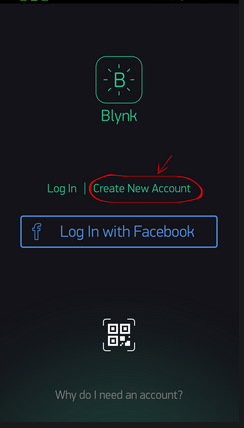
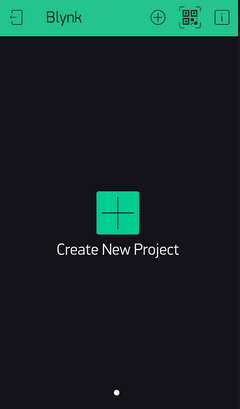
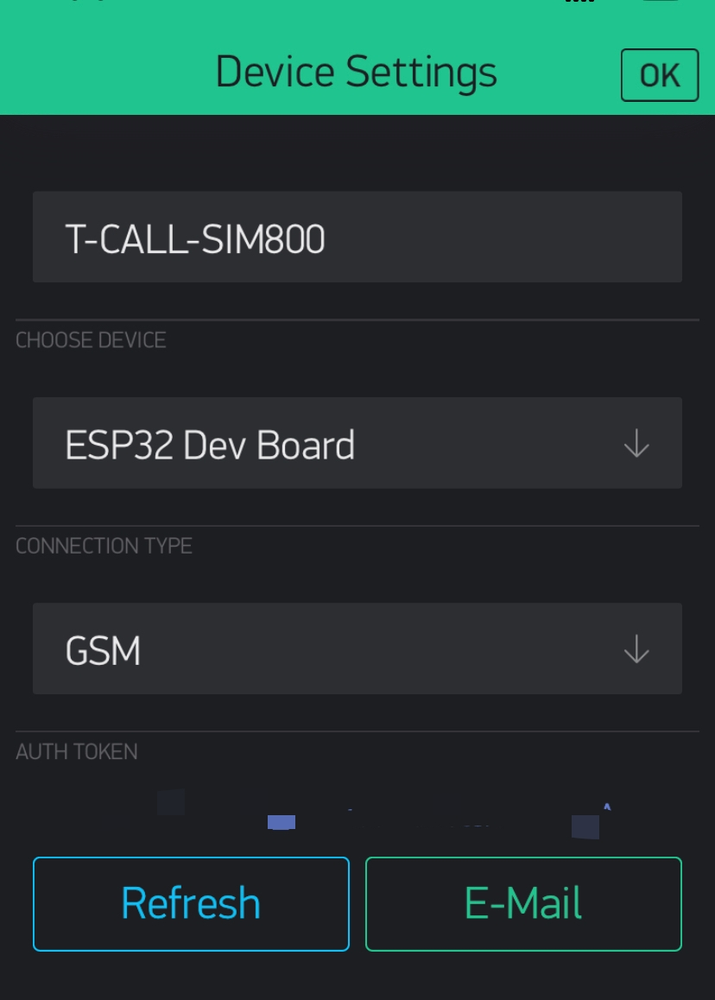
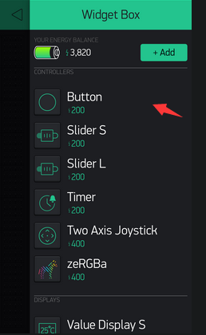

<h1 align = "center">🌟LilyGo-T-Call-SIM800🌟</h1>

## Quick start
1. Downloads APP
Blynk Apps for iOS or Android
2. Create a Blynk Account
After you download the Blynk App, you’ll need to create a New Blynk account.(If you have already created an account, you can skip this step)

  

3. Create a New Project
After you’ve successfully logged into your account, start by creating a new project.

  

4. Choose Your Hardware
Select the hardware model you will use. 

  

5. Add a Widget

  

6. Upload routines 

## Blynk References

1. [Getting Started Guide](https://www.blynk.cc/getting-started)
2. [Documentation](http://docs.blynk.cc/)
3. [Sketch generator](https://examples.blynk.cc/)
