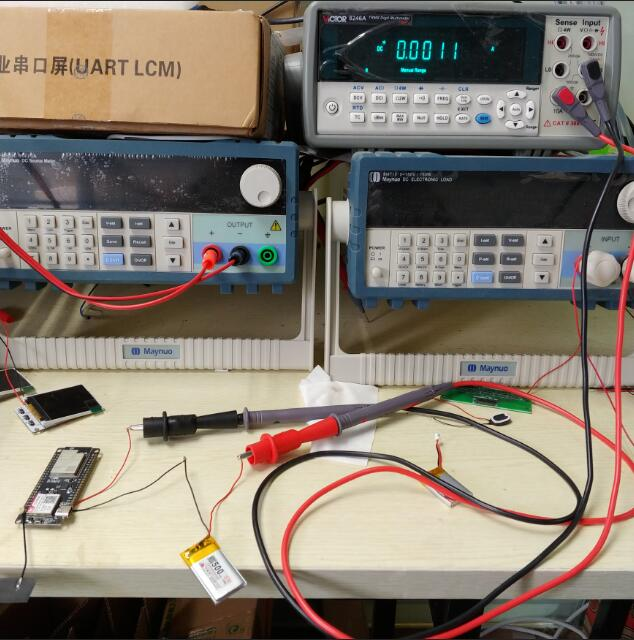

## Install the following dependency library files:
[SIM800_Library](https://github.com/lewisxhe/SIM800_Library)

#### description:
Use battery test when esp32 is in deep sleep state, current is about 1.1mA

